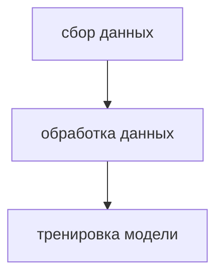

# PipelineML
Данные собираются с данной [api](https://www.weatherapi.com/)  

Всего 47 различных состояний погоды, т.е классов, из них большая часть будет либо недоступна либо очень маленькой именно поэтому в коде есть удаление редких классов количество которых меньше чем 10  
Так или иначе будет дизбаланс классов ввиду того что api максимум что может дать это данные неделю назад, из-за этого будут преобладать классы летней погоды, поэтому главной метрикой становится weighted f1_score  
В коде реализована простая реализация обучения модели, но при желании можно добавить поиск гиперпараметров с помощью библиотеки optuna и сравнить другие алгоритмы машинного обучения  

Для запуска контейнеров необходимо ввести в терминал :
```docker-compose up -d.```  
Пароли и логин также можно настроить в docker-compose.yaml, по дефолту логин airflow и пароль airflow, к pgadmin логин airflow@airflow.com а пароль airflow.
# Архитектура пайплайна

