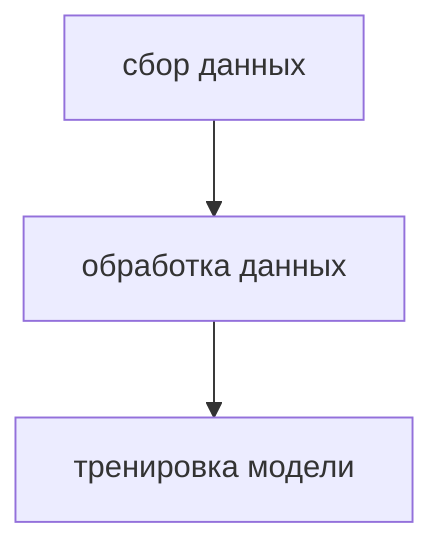

# PipelineML
Структура проекта:  
● Pipeline: Airflow.  
● API : [api](https://www.weatherapi.com/).  
● Loging : MLflow.  
● Containerization: Docker.  
● ML: scikit-learn.  
● Кол-во классов: 47.  

Реализованы следующие функции:
1. Удаление редких классов, количество которых меньше чем 10.    
2. Логирование артефактов моделей, а также метрик через MLflow.  
3. Запуск пайплайна по расписанию.   

# Архитектура пайплайна

