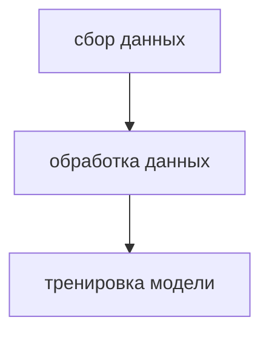

Для запуска контейнеров необходимо ввести в терминал :
```docker-compose up -d.```  
Пароли и логин также можно настроить в docker-compose.yaml, по дефолту логин airflow и пароль airflow, к pgadmin логин airflow@airflow.com а пароль airflow.
# Архитектура пайплайна

