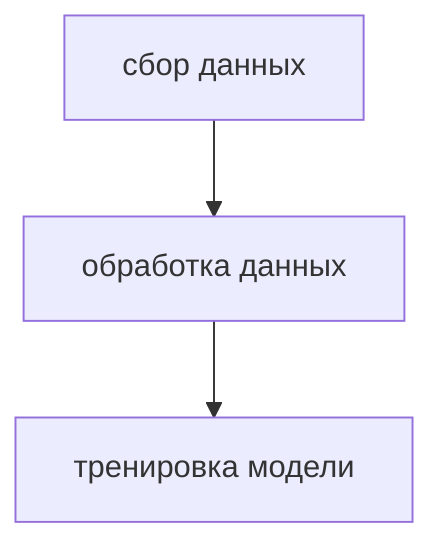

# PipelineML
Структура проекта:   
● API : [api](https://www.weatherapi.com/).  
● Кол-во классов: 47.  

Реализованы следующие функции:
1. Удаление редких классов, количество которых меньше чем 10.    
2. Логирование артефактов моделей, а также метрик через MLflow.  
3. Запуск пайплайна по расписанию.   

# Архитектура пайплайна

```mermaid
graph TD;
  A[сбор данных] --> B[обработка данных];
  B --> C[тренировка модели];
```
